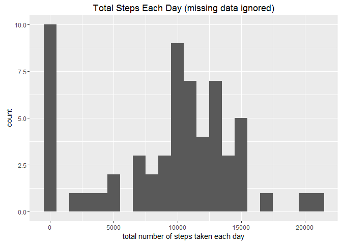
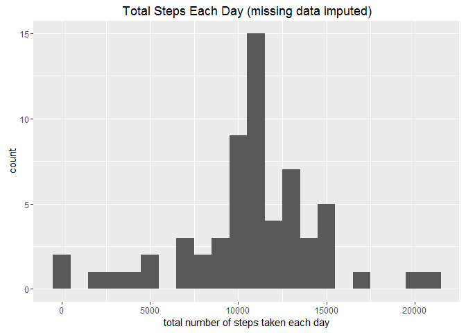

# Reproducible Research: Peer Assessment 1
Kun He  
Friday, September 2, 2016  


#Introduction

This document is the first project for the **Reproducible Research** course in Coursera's Data Science specialization track. This document is written in a single R markdown document that can be processed by knitr and transformed into an HTML file.

The data used in this project is [Activity monitoring data](https://d396qusza40orc.cloudfront.net/repdata%2Fdata%2Factivity.zip), data about personal movement using activity monitoring devices such as a [Fitbit](http://www.fitbit.com/nl), [Nike Fuelband](http://www.nike.com/us/en_us/c/nikeplus-fuelband), or [Jawbone Up](https://jawbone.com/up). This device collects data at 5 minute intervals through out the day. The data consists of two months of data from an anonymous individual collected during the months of October and November, 2012 and include the number of steps taken in 5 minute intervals each day.


## R Preparations

Before the analysis, first prepare the basic settings and activate relevant libraries for the analysis.
Also remember to set the dirrectory using setwd function.

```r
library(knitr)
opts_chunk$set(echo = TRUE)

library(lattice)
library(ggplot2)
library(dplyr)
```

```
## 
## Attaching package: 'dplyr'
```

```
## The following objects are masked from 'package:stats':
## 
##     filter, lag
```

```
## The following objects are masked from 'package:base':
## 
##     intersect, setdiff, setequal, union
```

## Loading and preprocessing the data

Download the dataset [Activity monitoring data](https://d396qusza40orc.cloudfront.net/repdata%2Fdata%2Factivity.zip) into the working dirrectory, unzip and load data into data frame `data`. Then use read.csv() function to load the data into data frame `data`.

```r
unzip(zipfile="activity.zip")
data <- read.csv("activity.csv")
```


## What is mean total number of steps taken per day?

Create a histogram showing the distribution of steps taken.

```r
total.steps <- tapply(data$steps, data$date, FUN=sum, na.rm=TRUE)
qplot(total.steps, binwidth=1000, main = paste("Total Steps Each Day (missing data ignored)"), xlab="total number of steps taken each day")
```

<!-- -->

Create the mean and median of steps taken.

```r
rmean <- mean(total.steps, na.rm=TRUE)
rmedian <- median(total.steps, na.rm=TRUE)
```
The `mean` is 9354.2295082 and the `median` is 10395.


## What is the average daily activity pattern?

Create a time series plot by summarizing the average steps taken (y-axis) based on a 5-minute interval (x-axis).


```r
averages <- aggregate(x=list(steps=data$steps), by=list(interval=data$interval),
                      FUN=mean, na.rm=TRUE)
ggplot(data=averages, aes(x=interval, y=steps)) +
    geom_line() +
    xlab("5-minute interval") +
    ylab("average number of steps taken")
```

<!-- -->

Check which 5-minute interval, on average across all the days in the dataset, contains the maximum number of steps

```r
averages[which.max(averages$steps),]
```

```
##     interval    steps
## 104      835 206.1698
```

## Imputing missing values

#### Check the missing data status


```r
missing <- is.na(data$steps)
table(missing)
```

```
## missing
## FALSE  TRUE 
## 15264  2304
```

#### Replace each missing value with the mean value of its 5-minute interval


```r
fill.value <- function(steps, interval) {
    filled <- NA
    if (!is.na(steps))
        filled <- c(steps)
    else
        filled <- (averages[averages$interval==interval, "steps"])
    return(filled)
}
filled.data <- data
filled.data$steps <- mapply(fill.value, filled.data$steps, filled.data$interval)
```

Create a new histogram showing the distribution of steps taken based on imputed data.

```r
total.steps <- tapply(filled.data$steps, filled.data$date, FUN=sum)
qplot(total.steps, binwidth=1000, main = paste("Total Steps Each Day (missing data imputed)"), xlab="total number of steps taken each day")
```

<!-- -->

```r
#Mean and median number of steps taken each day
mean(total.steps)
```

```
## [1] 10766.19
```

```r
median(total.steps)
```

```
## [1] 10766.19
```

## Are there differences in activity patterns between weekdays and weekends?

First we create a new factor variable `day` with two levels - "weekday" and "weekend" based on `date` variable.


```r
weekday.or.weekend <- function(date) {
    day <- weekdays(date)
    if (day %in% c("Monday", "Tuesday", "Wednesday", "Thursday", "Friday"))
        return("weekday")
    else if (day %in% c("Saturday", "Sunday"))
        return("weekend")
    else
        stop("invalid date")
}
filled.data$date <- as.Date(filled.data$date)
filled.data$day <- sapply(filled.data$date, FUN=weekday.or.weekend)
```

Create a pair time series plots for both weekday and weekend scenarios.


```r
averages <- aggregate(steps ~ interval + day, data=filled.data, mean)
ggplot(averages, aes(interval, steps)) + geom_line() + facet_grid(day ~ .) +
    xlab("5-minute interval") + ylab("Number of steps")
```

<!-- -->
